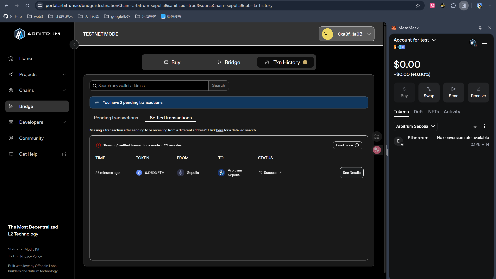

# arbitrum-rust-colearning-louis
HackQuest Arbitrum的共学营学习项目

---

## 🚀 任务进度 (Task Progress)

- [x] **Task-1: Hello Web3 - 环境搭建与基础链上连接**
- [ ] Task-2: Rust 基础与 Arbitrum 合约交互
- [ ] Task-3: Stylus 合约开发实战

---

## 🛠 Task-1 实践笔记

在搭建 Arbitrum Sepolia 测试网环境时，由于网络环境（VPN）限制，遇到并解决了以下问题：

### 1. 钱包网络配置
* **痛点**：通过 `chainlist.org` 自动添加网络时，受 VPN 影响，MetaMask 往往无法弹出确认框。
* **对策**：采用手动配置 RPC 参数。
    * **Chain ID**: `421614`
    * **RPC URL**: `https://endpoints.omniatech.io/v1/arbitrum/sepolia/public`
    * **Explorer**: [https://sepolia.arbiscan.io](https://sepolia.arbiscan.io)
> **相关截图：**

### 2. 测试币申领 (Faucet)
* **Alchemy 限制**：领水页面因 IP 识别问题多次失败。
* **成功路径**：使用 [Sepolia PoW Faucet](https://sepolia-faucet.pk910.de/) 通过本地算力挖矿获得 L1 Sepolia ETH，随后通过 [Arbitrum Bridge](https://bridge.arbitrum.io/) 成功跨链至 L2。
> **相关截图：**

## 📁 仓库说明
* **/docs**: 存放任务相关的操作截图及详细说明文档。
* **LICENSE**: 本项目采用 MIT 开源许可证。

---

## 📜 许可证 (License)
本项目采用 **MIT License**。详情请参阅 [LICENSE](LICENSE) 文件。
