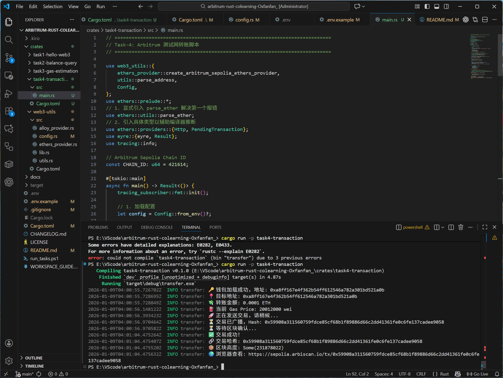

# arbitrum-rust-colearning-louis
HackQuest Arbitrum 共学营学习项目

## 🚀 快速开始

```bash
# 克隆项目
git clone <repo-url>
cd arbitrum-rust-colearning

# 配置环境
cp .env.example .env
# ⚠️ 注意：运行 Task-4 前需在 .env 中配置 PRIVATE_KEY

# 运行 Task
cargo run -p task1-hello-web3
cargo run -p task2-balance-query
cargo run -p task3-gas-estimation
cargo run -p task4-transaction

# 或使用脚本（Windows）
.\run_tasks.ps1 all

## 📦 项目结构


crates/
├── web3-utils/              # 共享库
├── task1-hello-web3/        # Task-1（Alloy）
├── task2-balance-query/     # Task-2（Ethers）
├── task3-gas-estimation/    # Task-3: Gas 估算（Ethers）
└── task4-transaction/       # Task-4: 转账脚本（Ethers）


**架构优势**：Workspace 统一管理，支持 Alloy 和 Ethers 双库，代码复用 80%

## 📝 Task 说明

### Task-1: Hello Web3（Alloy）
连接 Arbitrum Sepolia，获取最新区块高度
- 代码：`crates/task1-hello-web3/src/main.rs`
- 排坑记录：见下方

### Task-2: 查询余额（Ethers）
查询地址 ETH 余额，Wei → ETH 转换
- 代码：`crates/task2-balance-query/src/main.rs`

### Task-3: Gas 估算（Ethers）
动态获取 Gas 价格，计算转账费用
- 代码：`crates/task3-gas-estimation/src/main.rs`
  
### Task-4: 转账脚本（Ethers）
读取私钥，签名并发送 ETH 转账交易
- 代码：`crates/task4-transaction/src/main.rs`
- 安全提示：私钥仅保存在本地 .env，禁止上传 GitHub
  
## 🛠 环境搭建排坑

### 1. 钱包网络配置
VPN 影响下，MetaMask 无法自动添加网络。手动配置：
- Chain ID: `421614`
- RPC URL: `https://endpoints.omniatech.io/v1/arbitrum/sepolia/public`
- Explorer: https://sepolia.arbiscan.io


### 2. 测试币申领
Alchemy 限制，使用 [Sepolia PoW Faucet](https://sepolia-faucet.pk910.de/) 挖矿获得 L1 ETH，再通过 [Arbitrum Bridge](https://bridge.arbitrum.io/) 跨链至 L2


### 3. Rust 与 C++ 编译环境（Windows 11）
```bash
# 安装 Rust
winget install Rustlang.Rustup

# 安装 Visual Studio Build Tools 2022
# 勾选"使用 C++ 的桌面开发"工作负载，重启电脑
```


### 4. RPC 限流问题
初次运行遇到 429 错误，更换为 Arbitrum 官方 RPC 节点解决


### 5.链上转账
在编写转账脚本时，ethers-rs 常见的两个编译错误及解法：

* **找不到函数 (`not found in this scope`)**
    `parse_ether` 等工具函数不在 prelude 中，需手动引入：
    ```rust
    use ethers::utils::parse_ether;
    ```

* **类型推断失败 (`type annotations needed`)**
    `send_transaction` 返回的 `PendingTransaction` 无法自动推断底层 Provider 类型（如 Http/Ws）。需显式标注：
    ```rust
    use ethers::providers::{Http, PendingTransaction};
    // ...
    let pending_tx: PendingTransaction<'_, Http> = client.send_transaction(tx, None).await?;
    ```



## 📚 文档

- `WORKSPACE_GUIDE.md` - 架构指南和 API 文档
- `CHANGELOG.md` - 版本更新记录

## 📄 许可证
MIT License
