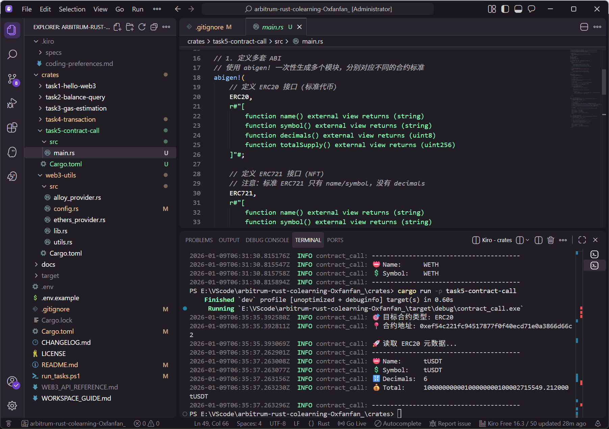

# arbitrum-rust-colearning-louis
HackQuest Arbitrum 共学营学习项目

## � 前置要求

- **Rust 1.70+** - [安装指南](https://www.rust-lang.org/tools/install)
- **Cargo** - 随 Rust 自动安装
- **Windows 用户** - 需要 Visual Studio Build Tools 2022（C++ 工作负载）

## 🚀 快速开始

```bash
# 克隆项目
git clone <repo-url>
cd arbitrum-rust-colearning

# 配置环境
cp .env.example .env
# ⚠️ 注意：运行 Task-4 前需在 .env 中配置 PRIVATE_KEY

# 运行单个 Task
cargo run -p task1-hello-web3
cargo run -p task2-balance-query
cargo run -p task3-gas-estimation
cargo run -p task4-transaction
cargo run -p task5-contract-call

# 或使用脚本（Windows）
.\run_tasks.ps1 all
```

## 📦 项目结构

```
crates/
├── web3-utils/              # 共享库（Provider, Config, Utils）
├── task1-hello-web3/        # Task-1: 基础连接（Alloy）
├── task2-balance-query/     # Task-2: 余额查询（Ethers）
├── task3-gas-estimation/    # Task-3: Gas 估算（Ethers）
├── task4-transaction/       # Task-4: 转账脚本（Ethers）
└── task5-contract-call/     # Task-5: 合约调用（Ethers + abigen）
```

**架构优势**：Workspace 统一管理，支持 Alloy 和 Ethers 双库，代码复用 80%
## 📝 Task 说明

### Task-1: Hello Web3（Alloy）
连接 Arbitrum Sepolia，获取最新区块高度
- 代码：`crates/task1-hello-web3/src/main.rs`
- 排坑记录：VPN 影响下，MetaMask 无法自动添加网络。手动配置：
- Chain ID: `421614`
- RPC URL: `https://endpoints.omniatech.io/v1/arbitrum/sepolia/public`
- Explorer: https://sepolia.arbiscan.io


### Task-2: 查询余额（Ethers）
查询地址 ETH 余额，Wei → ETH 转换
- 代码：`crates/task2-balance-query/src/main.rs`
- 排坑记录：Alchemy 限制，使用 [Sepolia PoW Faucet](https://sepolia-faucet.pk910.de/) 挖矿获得 L1 ETH，再通过 [Arbitrum Bridge](https://bridge.arbitrum.io/) 跨链至 L2


### Task-3: Gas 估算（Ethers）
动态获取 Gas 价格，计算转账费用
- 代码：`crates/task3-gas-estimation/src/main.rs`
- 排坑记录：Rust 与 C++ 编译环境（Windows 11）
* **安装 Rust：** winget install Rustlang.Rustup
* **安装 Visual Studio Build Tools 2022：** 勾选"使用 C++ 的桌面开发"工作负载，重启电脑


### Task-4: 转账脚本（Ethers）
读取私钥，签名并发送 ETH 转账交易
- 代码：`crates/task4-transaction/src/main.rs`
- 安全提示：私钥仅保存在本地 .env，禁止上传 GitHub


### Task-5: 调用智能合约（Ethers）
使用 `abigen!` 宏生成类型安全的合约绑定，读取链上合约元数据。
- 代码：`crates/task5-contract-call/src/main.rs`
- 功能：支持通过环境变量动态切换 **ERC20** 或 **ERC721** 模式。
- 配置：需在 `.env` 中设置 `CONTRACT_ADDRESS` 和 `CONTRACT_TYPE`。




## 📚 文档

- **[工作空间指南](WORKSPACE_GUIDE.md)** - 项目架构和开发指南

## ❓ 常见问题

### Q: 如何配置私钥？
A: 在 `.env` 文件中添加 `PRIVATE_KEY=0x...`，仅用于本地测试，不要上传到 GitHub

### Q: 如何切换不同的网络？
A: 修改 `.env` 中的 `ARBITRUM_SEPOLIA_RPC` 或在代码中调用 `create_ethers_provider(custom_rpc)`

### Q: abigen 宏如何使用？
A: 参考 Task-5 的实现，需要在 `build.rs` 中配置 ABI 源，详见 [Web3 API 参考](WEB3_API_REFERENCE.md)

### Q: Windows 编译失败怎么办？
A: 需要安装 Visual Studio Build Tools 2022，勾选"使用 C++ 的桌面开发"工作负载，然后重启电脑

## 📄 许可证
MIT License
