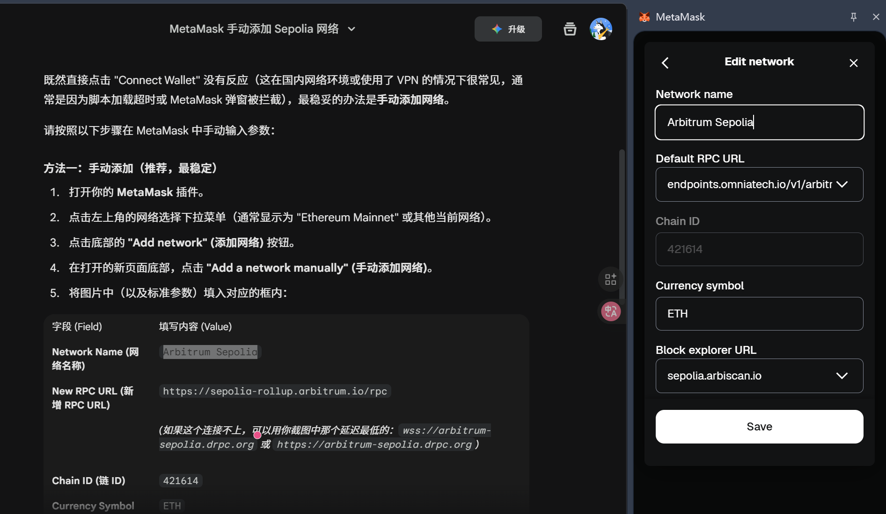
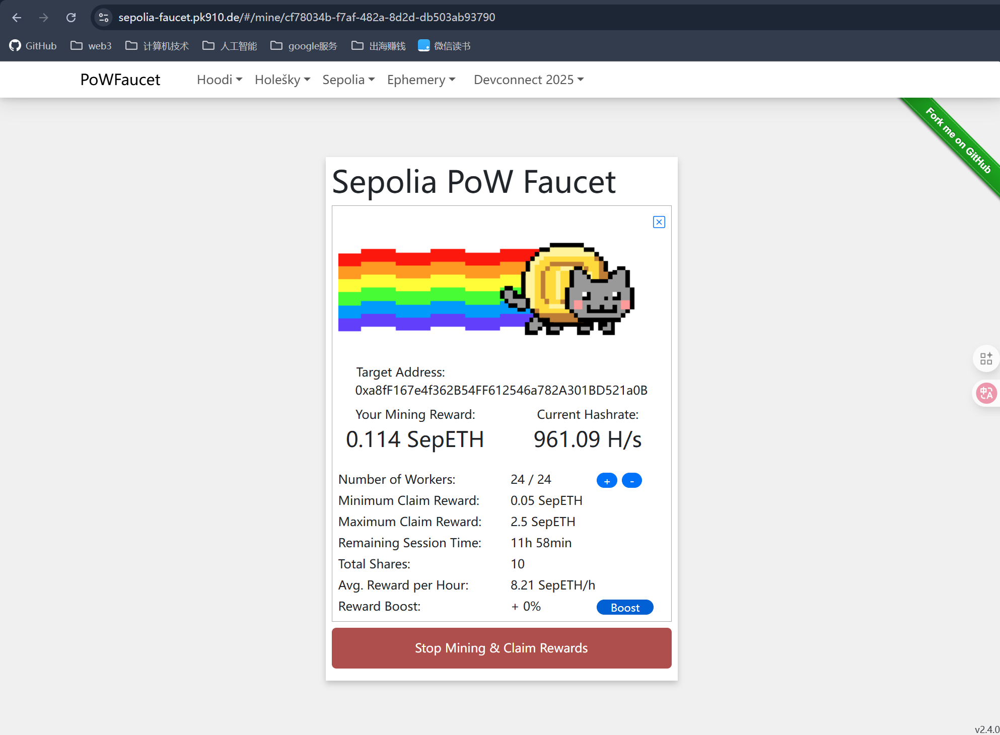
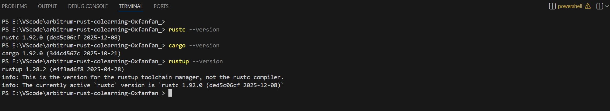
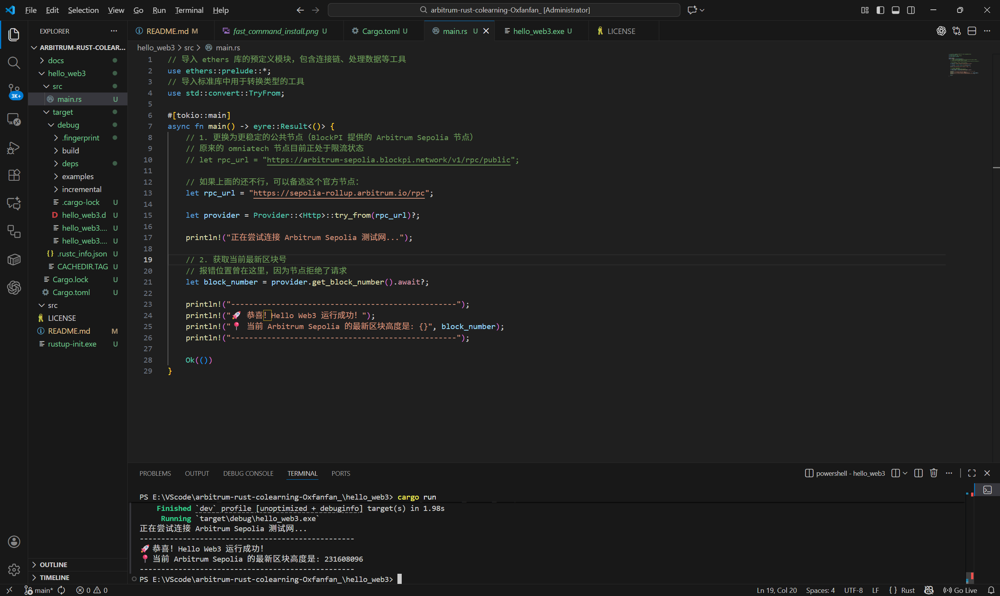
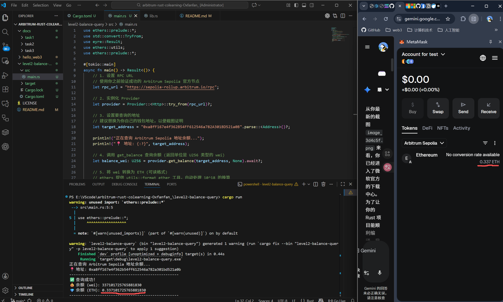
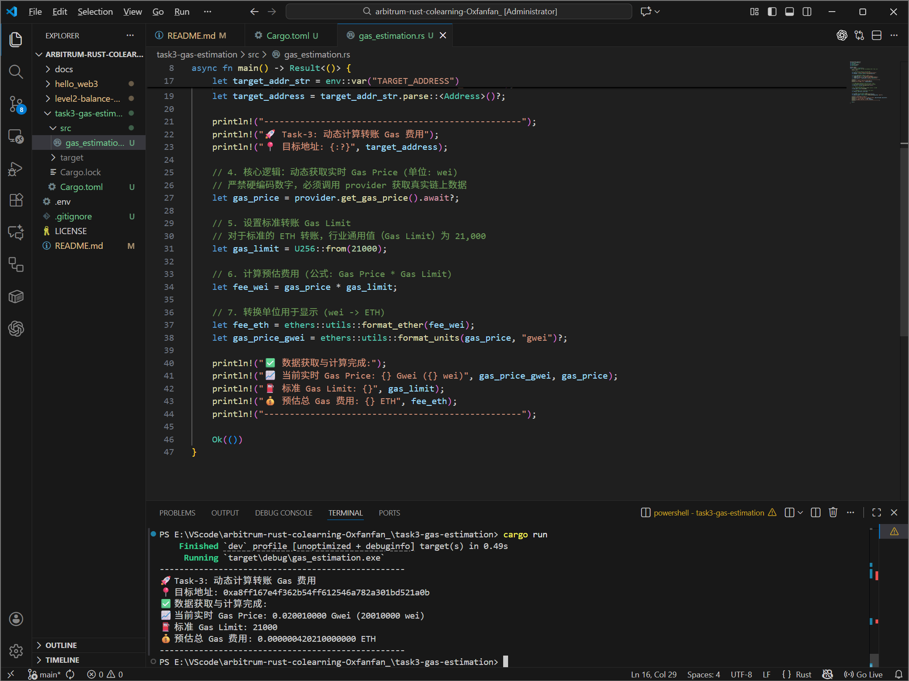

# arbitrum-rust-colearning-louis
HackQuest Arbitrum的共学营学习项目

---

## 🚀 任务进度 (Task Progress)

- [x] **Task-1: Hello Web3 - 环境搭建与基础链上连接**
- [x] **Task-2: 查询 Arbitrum 测试网地址余额**
- [x] **Task-3: 计算 Arbitrum 转账 Gas 费用**

---

## 🛠 Task-1 实践笔记

在搭建 Arbitrum Sepolia 测试网环境时，由于网络环境（VPN）限制，遇到并解决了以下问题：

### 1. 钱包网络配置
* **痛点**：通过 `chainlist.org` 自动添加网络时，受 VPN 影响，MetaMask 往往无法弹出确认框。
* **对策**：采用手动配置 RPC 参数。
    * **Chain ID**: `421614`
    * **RPC URL**: `https://endpoints.omniatech.io/v1/arbitrum/sepolia/public`
    * **Explorer**: [https://sepolia.arbiscan.io](https://sepolia.arbiscan.io)
> **相关截图：**


### 2. 测试币申领 (Faucet)
* **Alchemy 限制**：领水页面因 IP 识别问题多次失败。
* **成功路径**：使用 [Sepolia PoW Faucet](https://sepolia-faucet.pk910.de/) 通过本地算力挖矿获得 L1 Sepolia ETH，随后通过 [Arbitrum Bridge](https://bridge.arbitrum.io/) 成功跨链至 L2。
> **相关截图：**



### 3. Rust 与 C++ 编译环境安装 (Windows 11)
* **环境安装**：通过 Windows 官方包管理器 `winget` 一键安装 Rust 工具链：`winget install Rustlang.Rustup`。
* **解决 C++ 依赖 (Critical)**：Rust 在 Windows 编译 `ethers` 等 Web3 库时依赖 C++ 生成工具。通过手动安装 **Visual Studio Build Tools 2022** 并勾选 **“使用 C++ 的桌面开发”** 工作负载，成功解决了 `Linker` 缺失导致的编译错误，安装好后重启电脑。
> **相关截图：**




### 4. Hello Web3 代码实现与排坑
* **RPC 限流 (429 Error)**：初次运行程序时，由于公共 RPC 节点（Omniatech）限流，导致 `Too many requests` 报错。
* **对策**：将 `rpc_url` 更换为 Arbitrum 官方 RPC 节点，程序成功通过编译并实时读取链上数据。
* **验证结果**：
  > 🚀 恭喜！Hello Web3 运行成功！  
  > 📍 当前 Arbitrum Sepolia 的最新区块高度是: 23168096
> **相关截图：**


---

## 🛠 Task-2 实践笔记：查询 Arbitrum 测试网地址余额

### 1. 功能实现
* **核心逻辑**：编写 Rust 函数，通过 `ethers-rs` 库连接 Arbitrum Sepolia 节点，查询指定地址的 ETH 余额。
* **单位转换**：利用 `ethers::utils::format_ether` 将余额从 **wei** 转换为可读的 **ETH** 格式。

### 2. 编译排坑
* **报错处理**：初次编译遇到 `use of unresolved module or unlinked crate utils` 错误。
* **解决**：确认 `utils` 是 `ethers` 的子模块，通过 `use ethers::utils;` 导入后解决。

### 3. 运行结果验证
* **查询地址**：`0xa8ff167e4f362b54ff612546a782a301bd521a0b`
* **查询余额**：约 `0.337 ETH`
* **相关截图**：


---

## 🛠 Task-3 实践笔记：计算 Arbitrum 转账 Gas 费用

### 1. 功能实现
* **动态获取 Gas Price**：拒绝硬编码，通过 `provider.get_gas_price()` 实时从 Arbitrum Sepolia 获取链上 Gas 价格（单位：wei），确保计算结果的实时性。
* **物理公式计算**：严格执行以下公式进行预估计算：
  $$Gas\ Fee = Gas\ Price \times Gas\ Limit$$
  针对标准 ETH 转账，设置 `Gas Limit` 为行业通用值 **21,000**。
* **环境变量管理**：引入 `dotenvy` 库，将 `TARGET_ADDRESS` 存储在根目录的 `.env` 文件中，实现配置与代码逻辑的解耦。

### 2. 运行结果验证
* **计算逻辑**：程序成功通过 RPC 节点获取实时价格，并完成从 `wei` 到 `ETH` 的单位换算。
* **相关截图**：


> **注**：由于 Arbitrum 属于 Layer 2 网络，其实际转账费用极低，预估费用通常在 $10^{-6}$ ETH 数量级。

---

## 🚀 如何运行 (How to Run)

克隆本项目后，请按照以下步骤操作：

1. **创建配置文件**：在项目根目录下新建一个名为 `.env` 的文件。
2. **配置变量**：在 `.env` 中添加你的测试地址，格式如下：
   ```text
   TARGET_ADDRESS=你的钱包地址
   
📁 仓库说明
* **/docs**: 存放任务相关的操作截图及详细说明文档。
* **/hello_web3**: Task-1 的 Rust 工程源代码。
* **/level2-balance-query**: Task-2 的 Rust 工程源代码。
* **/task3-gas-estimation**: Task-3 的 Rust 工程源代码。
* **LICENSE**: 本项目采用 MIT 开源许可证。

📜 许可证 (License)
本项目采用 MIT License。详情请参阅 LICENSE 文件。